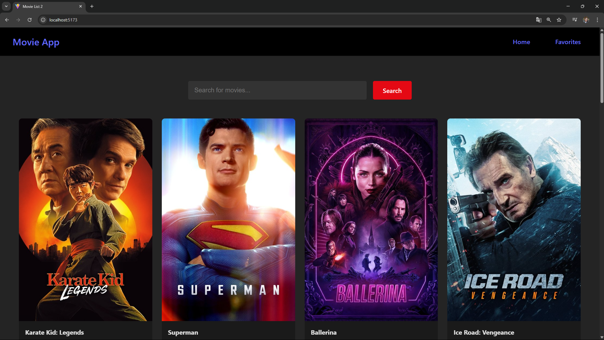

# 🎬 MovieSite

MovieSite, kullanıcıların en yeni filmleri keşfetmesini, detaylarına ulaşmasını ve favorilerine eklemesini sağlayan modern bir film web uygulamasıdır. React.js ile geliştirilmiştir.

## 🚀 Özellikler

- 🎞️ Popüler ve güncel filmleri listeleme
- 🔍 Film adıyla arama yapabilme
- 📝 Film detaylarını görme (puan, açıklama, çıkış tarihi vb.)
- ❤️ Favorilere ekleme / çıkarma
- 🌙 Karanlık ve aydınlık tema desteği (isteğe bağlı)

## 🛠️ Kullanılan Teknolojiler

- React.js
- Axios
- TMDB API  
  [https://www.themoviedb.org/documentation/api](https://www.themoviedb.org/documentation/api)
- React Router DOM
- CSS (özelleştirilmiş stil yapısı)

## 📸 Ekran Görüntüsü

Ana sayfa görünümü:



## ⚙️ Kurulum

Projeyi kendi bilgisayarınızda çalıştırmak için aşağıdaki adımları takip edebilirsiniz:

```bash
git clone https://github.com/ShamsSannoufaa/MovieSite.git
cd MovieSite
npm install
npm start
```

Tarayıcınızda otomatik olarak şu adreste çalışacaktır:
📍 http://localhost:3000

Ortam Değişkenleri
TMDB API anahtarınızı .env dosyasına şu şekilde ekleyin:
```bash
REACT_APP_TMDB_API_KEY=your_api_key_here
```

Proje Dosya Yapısı

```bash
MovieSite/
├── public/
├── src/
│   ├── components/
│   ├── pages/
│   ├── App.js
│   └── index.js
├── .env
├── package.json
├── screenshots/
│   └── homepage.png
└── README.md
```

👩‍💻 Geliştirici
Shams Sannoufa


 Lisans
MIT Lisansı © 2025 Shams Sannoufa


